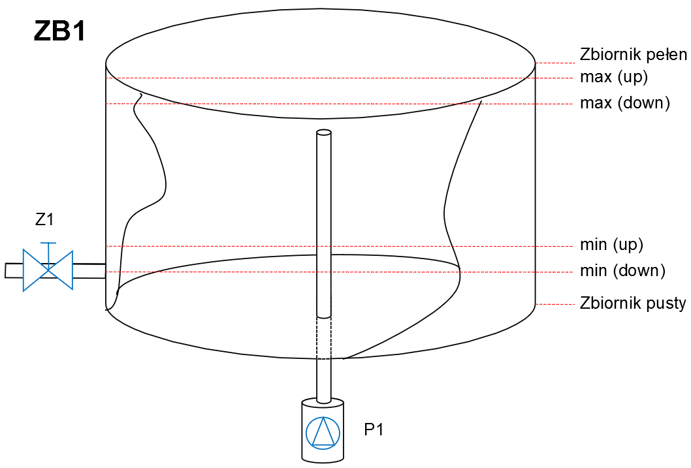
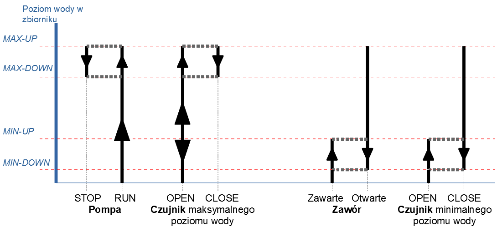

## 1. Opis
Woda do napełnienia zbiornika ZB1 jest pompowana przez pompę P1, a następnie wylewana przez zawór Z1. Ilość wylewanej wody nie jest stała, jest regulowana ręczne przez Operatora zbiorniku (prawdopodobnie, zgodnie z żądaniami konsumentów).

  

Aby uniknąć przepełnienia zbiornika i / lub opróżniania rury, zbiornik jest wyposażony w czujniki minimalnego i maksymalnego poziomu wody.

## 2. Algorytm sterowania

Warunki początkowe: zbiornik wody jest pusty, zawór wyboru wody jest zamknięty.

Urządzenie włącza się, naciskając przycisk START. Pompa dostarcza wodę do zbiornika. Po osiągnięciu poziomu „min-up” otwiera się zawór wylewania wody. Jeżeli pobór wody przekroczy natężenie przepływu, zawór zamknie się ponownie po osiągnięciu poziomu „min-down”. W przeciwnym razie zbiornik będzie nadal napełniany wodą, a gdy poziom osiągnie poziom „max-up”, pompa wyłączy się, a zawór pozostanie otwarty. Pompa włączy się ponowie, gdy osiągnie „max-down” poziom.

  

Operator może ręcznie zmienić przepustowość zaworu, podczas gdy układ sterowania nie pozwala na przelanie się zbiornika i / lub ewentualne uszkodzenie urządzenia w wyniku nagłej utraty wody w odprowadzanym rurociągu.

Naciśnięcie przycisku STOP powoduje wyłączenie pompy i zamknięcie zaworu.

## 3. Wejścia/wyjścia, registry sterownika M221

    Inputs:

| Adres | Opis |
| ----- | ---- |
| %I0.3 | Czujnik minimalnego poziomu wody |
| %I0.4 | Czujnik maksymalnego poziomu wody |
| %I0.5 | Przełącznik PRACA - TEST |
| %I0.6 | Przycisk STOP |
| %I0.7 | Przycisk START |

    Outputs:

| Adres | Opis |
| ----- | ---- |
| %Q0.6 | Sterowanie zaworem odpływu wody (zawarte - otwarte) |
| %Q0.7 | Sterowanie pracą pompy (ON - OFF) |

    Analog:

| Adres | Opis |
| ----- | ---- |
| %IW0.0 | Wydajność zaworu (ręczne sterowanie zaworem)  |
| %IW0.1 | Wydajność pompy (ręczne sterowanie pompą) |

    Registry:

| Adres | Opis |
| ----- | ---- |
| %M100 | RUN relay |
| %M101 | STOP relay |
| %M103 | Czujnik minimalnego poziomu wody |
| %M104 | Czujnik maksymalnego poziomu wody |
| %M105 | Tryb PRACA („1”) / TEST („0”) |
| %M106 | Zawór odpływu wody (zawarte - otwarte) |
| %M107 | Praca pompy (ON - OFF) |
| %MW108 | Wydajność zaworu (wylewanie) |
| %MW109 | Wydajność pompy (toczenie) |
| %MW110 | Bieżący poziom wody w zbiorniku |
| %MW111 | Górny limit czujnika maksymalnego poziomu wody (MAX-UP) |
| %MW112 | Dolny limit czujnika maksymalnego poziomu wody (MAX-DOWN) |
| %MW113 | Górny limit czujnika minimalnego poziomu wody (MIN-UP) |
| %MW114 | Dolny limit czujnika minimalnego poziomu wody (MIN-DOWN) |
| %M123 | Stan czujnika minimalnego poziomu wody |
| %M124 | Stan czujnika maksymalnego poziomu wody |

## 4. Opis programy

Program składa się z 4 POU.

POU 1. „Kontrola” opisuje reakcję sterownika na naciskanie przycisków START i STOP, przełącznika PRACA-TEST, przypisywanie wartości do stałych i zmiennych, które są używane w obliczeniach, w tym odczytywanie statusu wejść analogowych do ręcznego sterowania wydajnością zaworu i wydajnością pompy.

POU 2. „Sterowanie pompą i zaworem” opisuje odczytywanie stanu czujników poziomu wody w zbiorniku, tworzenie sygnałów do otwierania / zamykania zaworu i włączania / wyłączania pompy.

POU 3. „Emulator tłoczenia i wylewania” zawiera obliczenia poziomu wody w zbiorniku w zależności od działania pompy i otwarcia zaworu.

POU 4. „Emulator Histerezy Pływaków” emuluje zachowanie prawdziwych czujników poziomu wody.

## 5. Funkcjonowanie programy

5.1. Połącz (Launch) i uruchom (RUN) symulator sterownika, na przykład – TM221M16R/G.

5.2. Kliknij IN-7 (naciśnij przycisk START). Kliknij ponownie (zwolnij przycisk).

5.3. Jeśli system jest w trybie testowania (przełącznik %I0.5 nie jest wciśnięty), wartość %MW100 (bieżący poziom wody) wzrasta.

5.4. Po osiągnięciu wartości większej niż 400 (wyznaczono %MW113) wartość %M106 zmienia się na „1” (zawór otwiera się). Po osiągnięciu poziomu większego niż 1980 (%MW111), wartość %M107 zmienia się na „0” (silnik pompy jest wyłączony). Poziom spada, a gdy osiągnie mniej niż 1700 (%MW112), wartość %M107 ponownie staje się równa „1” (silnik pompy włącza się).

5.5. Jeżeli poziom wody spadnie poniżej 210 (%MW114), wówczas wartość %M106 zmienia się na „0” (zawór zamyka się). Wartość %M106 ponownie zmieni się na „1”, gdy poziom wody przekroczy 400 (%MW113).

5.6. Zmieniając stan wejść analogowych %IW0.0 i %IW0.1, można zaobserwować zachowanie systemu w warunkach zmiany wielkości poboru wody i wydajności pompy.

5.7. Kliknij IN-6 (naciśnij przycisk STOP), wyląc symulator.
